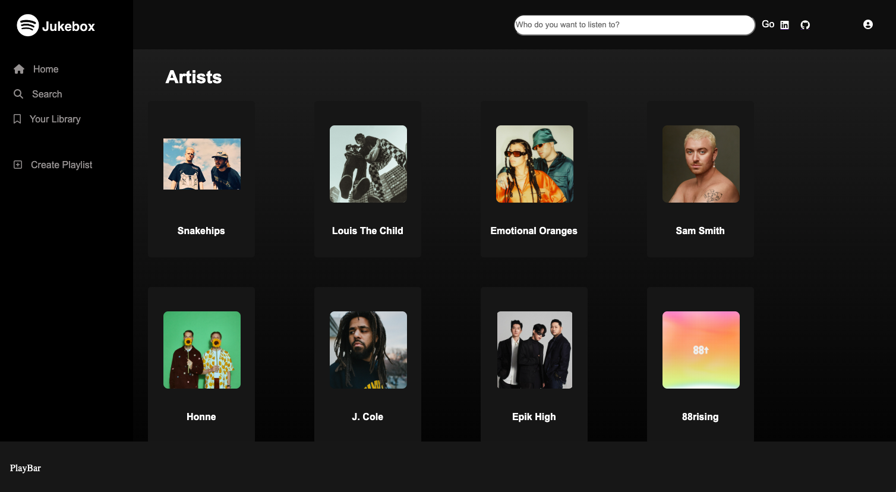

# Jukebox (Spotify Clone)



&emsp;

## Overview

Jukebox is a clone of the popular, digital music streaming service known as Spotify. This clone was made using Ruby on Rails as the backend and JavaScript for the frontend. Users can sign up to access all different genres of music from all over the world. Users (eventually) are able to search and listen to music using an interactive playbar that can play, pause, rewind and skip the current track. They can also create their own playlists and populate it with songs that they like. You can check out the clone on https://jukebox-ocuf.onrender.com by using the Demo Login option. Thank you and enjoy.

This clone will have many great features incorporated that will mimic the actual Spotify application. At this applications current state, the trickiest part is implementing the search bar function. Users should be able to search up an artist's name and be directed to that artist's page along with all of their information.

&emsp;

## Snippet Artist Thunk Actions & Reducer

```js
export const fetchArtists = () => async dispatch => {
    const res = await fetch(`/api/artists`)
    const data = await res.json()
    return dispatch(receiveArtists(data))
}

export const fetchArtist = (artistId) => async dispatch => {
    const res = await fetch(`/api/artists/${artistId}`)
    if (res.ok) {
        const data = await res.json()
        return dispatch(receiveArtist(data))
    }
}


const artistsReducer = (state={}, action) => {
    const newState = {...state}

    switch(action.type) {
        case RECEIVE_ARTISTS:
            return {...newState, ...action.artists}
        case RECEIVE_ARTIST:
            newState[action.payload.artist.id] = action.payload.artist
            return newState;
        default:
            return state;
    }
}
```

## Technologies and Libraries Used

* Ruby on Rails
* JavaScript
* React / Redux
* JSON / Jbuilder
* HTML
* CSS
* PostgreSQL
* AWS
* Render
* Font Awesome

## Future Implementations

* Playbar
* Playlists CRUD
* Liked Songs Playlist and Like Songs